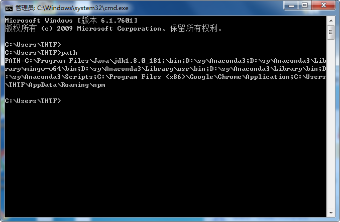
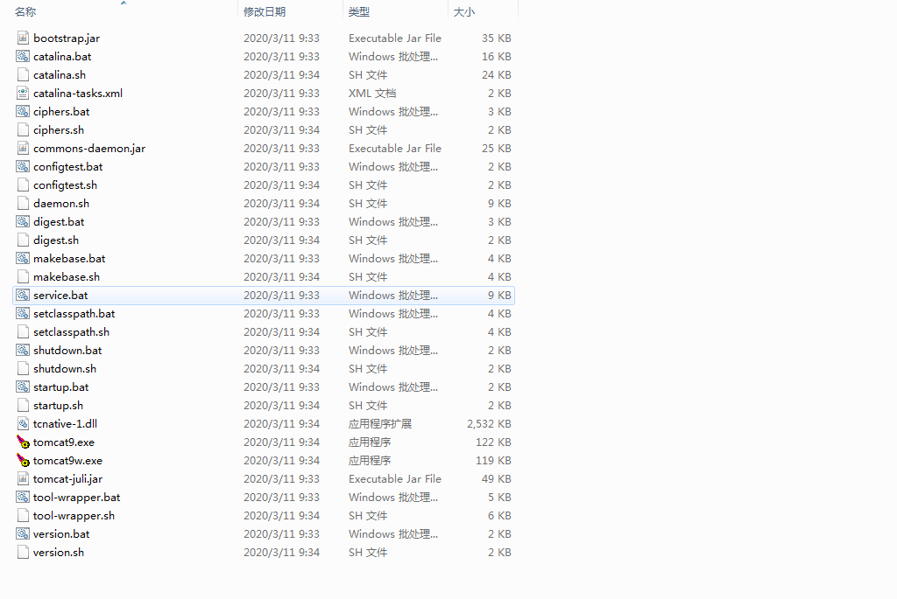
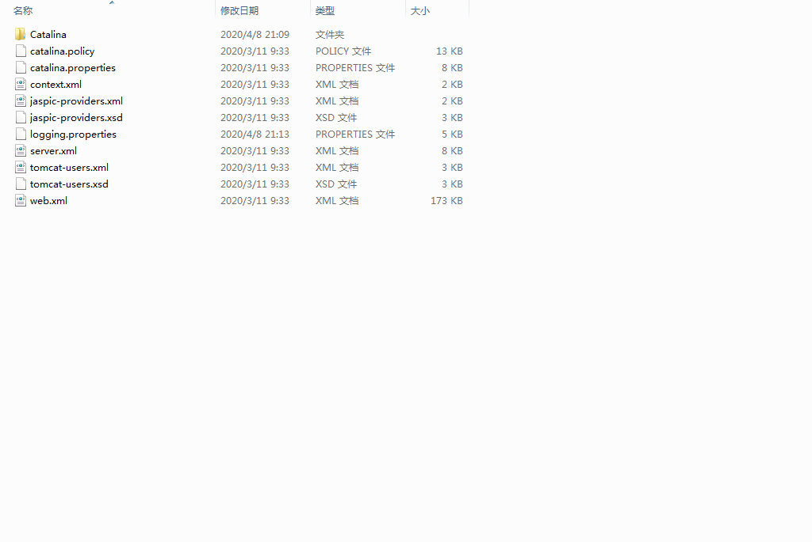
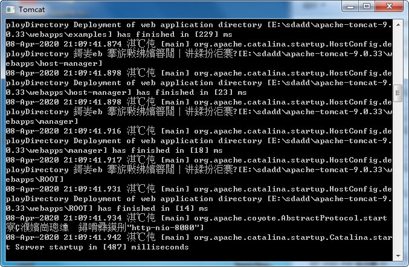
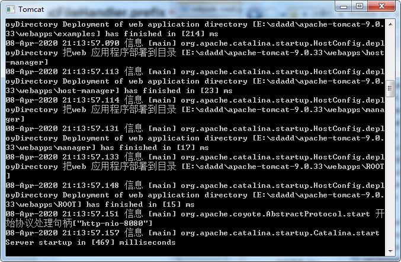

# JDK与JRE
### 安装JDK与配置路径
```
CLASSPATH
%JAVA_HOME%\lib;  
%JAVA_HOME%\lib\dt.jar;  
%JAVA_HOME%\lib\tools.jar

JAVA_HOME
C:\Program Files\Java\jdk1.8.0_181（!此处不应有分号）  
 
PATH
%JAVA_HOME%\bin;
```
配置环境出错：查看环境变量path;  
JAVA_HOME后加分号的结果  


# Tomacat
### 1.Tomcat目录结构
    bin
    conf
    logs
    webapps
    ....


### 2.启动与关闭Tomcat
关闭  
1.bin/shutdown.sh  
2.control+C


### 3.更改配置端口

### 4.部署和配置项目
#### 4.1 方法一
webapps/virtual/项目目录or war包  
localhost:8080/virtual虚拟目录/virtual.html资源
#### 4.2 方法二  
conf/server.xml

```
<host>
  <Content docBase="项目路径" path="虚拟目录"/>
<host>
```
#### 4.3 方法三(热部署)
conf/Catalina/localhost 下创建文件 <虚拟目录Name>.xml  
内容:  
```
<Content docBase="项目路径" />
```
#### 4.4 动态项目目录结构
```
src  
/--java  
/--resource
WEB-INF
/--web.xml
/--lib目录
/--Classes
```
```
├── pom.xml
└── src
    ├── main
    │   ├── java
    │   │   └── group
    │   │       ├── controller
    │   │       │   ├── HomeController.java
    │   │       │   └── PersonController.java
    │   │       ├── dao
    │   │       │   └── PersonDao.java
    │   │       └── model
    │   │           └── Person.java
    │   ├── resources
    │   │   ├── db.properties
    │   │   ├── log4j.xml
    │   │   └── META-INF
    │   │       └── persistence.xml
    │   └── webapp
    │       ├── index.html
    │       ├── META-INF
    │       │   ├── context.xml
    │       │   └── MANIFEST.MF
    │       ├── resources
    │       │   └── css
    │       │       └── screen.css
    │       └── WEB-INF
    │           ├── spring
    │           │   ├── app
    │           │   │   ├── controllers.xml
    │           │   │   └── servlet-context.xml
    │           │   ├── db.xml
    │           │   └── root-context.xml
    │           ├── views
    │           │   ├── edit.jsp
    │           │   ├── home.jsp
    │           │   └── list.jsp
    │           └── web.xml
    └── test
        ├── java
        │   └── group
        │       ├── controller
        │       │   ├── DataInitializer.java
        │       │   ├── HomeControllerTest.java
        │       │   └── PersonControllerTest.java
        │       └── dao
        │           └── PersonDaoTest.java
        └── resources
            ├── db.properties
            ├── log4j.xml
            ├── test-context.xml
            └── test-db.xml

```


### N.SomeQuestion
3.1 出现乱码


原因：  编码格式不一致  
解决方案：  conf/logging.properties  
All UTF-8 替换为GBK  
java.util.logging.ConsoleHandler.encoding = UTF-8


MAC下
server.xml 中
```
<Connector port="8080" protocol="HTTP/1.1"
               connectionTimeout="20000"
               redirectPort="8443" URIEncoding="UTF-8"/>
```

成功


3.2 出现一闪而过的黑屏

原   因：   Java环境变量设置错误  
解决方案：  重新设置环境变量

# Servlet
Server applet 运行在服务器端的小程序  
### 1.概念    
本质:是一个接口,interface,  
自定义一个类,复写serverlet方法
### 2.执行原理和生命周期
类没有对象,能执行其中的方法??WHY?Tomcat
```
@WebServlet("/demo2")
public class ServletDemo1 implements Servlet {

    public void init(ServletConfig servletConfig) throws ServletException {

    }

    public ServletConfig getServletConfig() {
        return null;
    }

    public void service(ServletRequest servletRequest, ServletResponse servletResponse) throws ServletException, IOException {
        System.out.println("hello Servlet");

    }

    public String getServletInfo() {
        return null;
    }

    public void destroy() {

    }
}
```
### 3.Servlet体系结构 
``` 
Servlet
   |  
   └── GenericServlet  
             |  
             └──  HttpServelet
```
Request继承体系
```
ServletRequest
     |  
     └── HttpServletRequest
             |  
             └── org.apache.catalina.connector.RequestFacade(Tomcat运行中实现)
```
#### 出现问题,看详细日志信息
/Users//Library/Logs/IntelliJIdea2019.2/idea.log

# IDLE使用问题
Error: Application Server not specified  
一、问题  
idea中的tomcat报错： Application Server not specified  
二、解决  
原因是没有关联本地的tomcat,关联本地tomcat即可  


