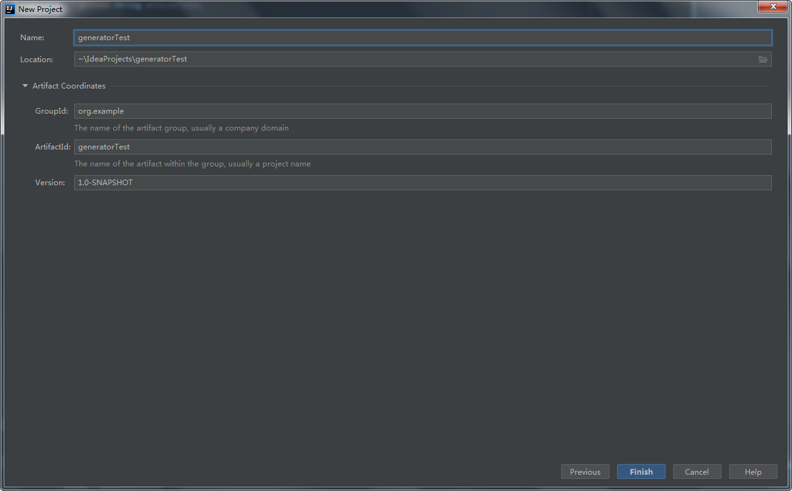
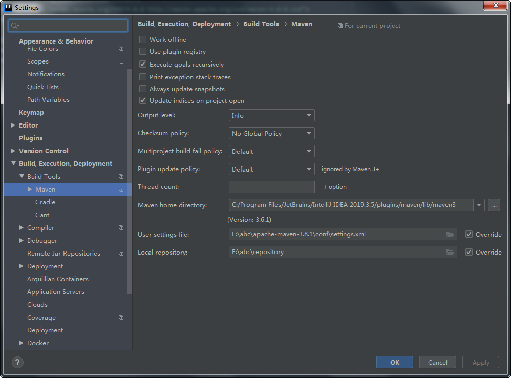
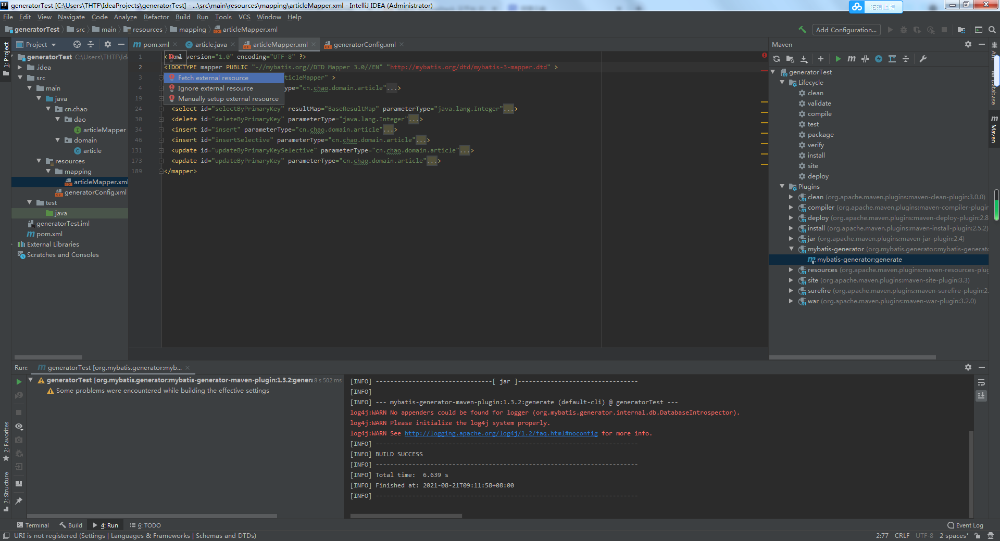

# 创建Maven工程
1.
  
2.

3.

4.【File】--【Settings】--【Build,Execution,Deployment】

5.配置到自己的Maven目录与仓库  

--
# 存在小问题
## Question1
> URL is not registered

> 右键拉取即可

# 知识点  
Maven入门  
https://juejin.cn/post/6844903543711907848  