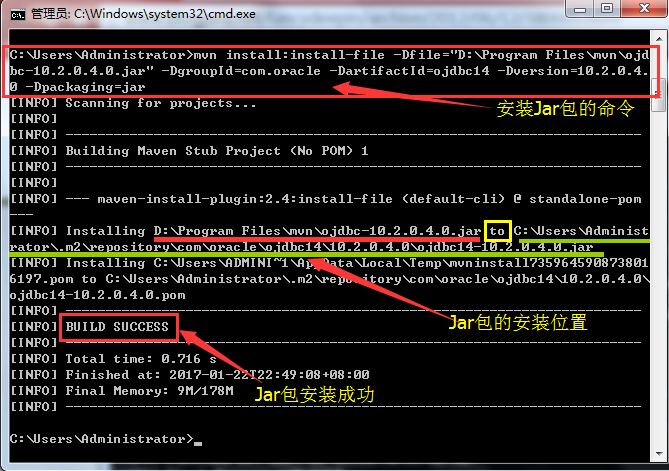

今天有个一直在报java bean生成的错位，究其根源，maven中缺少一个包，特此记录。  
缺这个包  
```
        <dependency>
            <groupId>org.springframework</groupId>
            <artifactId>spring-aop</artifactId>
            <version>${spring.version}</version>
        </dependency>
```
Maven----将手动下载的jar包以命令行的方式安装到指定位置的repo中

在maven文件的bin目录下
mvn install:install-file -Dfile=E:\abc\JavaDev\test\joda-time-2.10.13.jar  -DgroupId=com.test -DartifactId=test1 -Dversion=1.0.0 -Dpackaging=jar

-Dfile：包的本地真实地址

-DgroupId：pom.xml中groupId

-DartifactId：pom.xml中artifactId

-Dversion：pom.xml中0.0.1-SNAPSHOT

-Dpackaging：jar或war，包的后缀名



更改jar包安装位置，在于maven 》 configuration 》 setting

 <localRepository>F:\apache-maven-3.6.0\repository</localRepository>

参考：https://blog.csdn.net/aishun8091/article/details/101131602