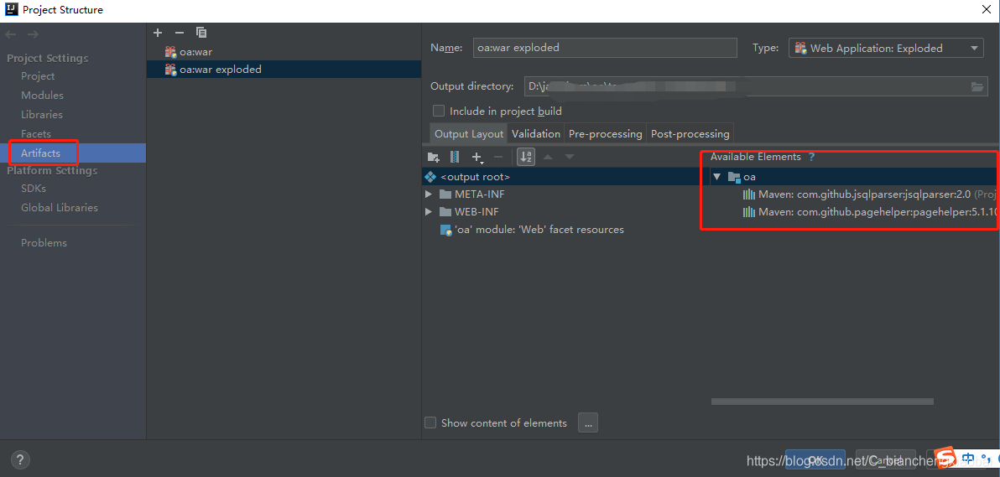

发现war_exploded并没有将pageHelper打包，
发现问题那就简单了，把pagehelper放到lib就行，

idea解决maven导入pageHelper插件，启动tomcat报ClassNotFoundException: com.github.pagehelper.PageInterceptor问题

https://blog.csdn.net/C_bianchengxiaobai/article/details/100574136