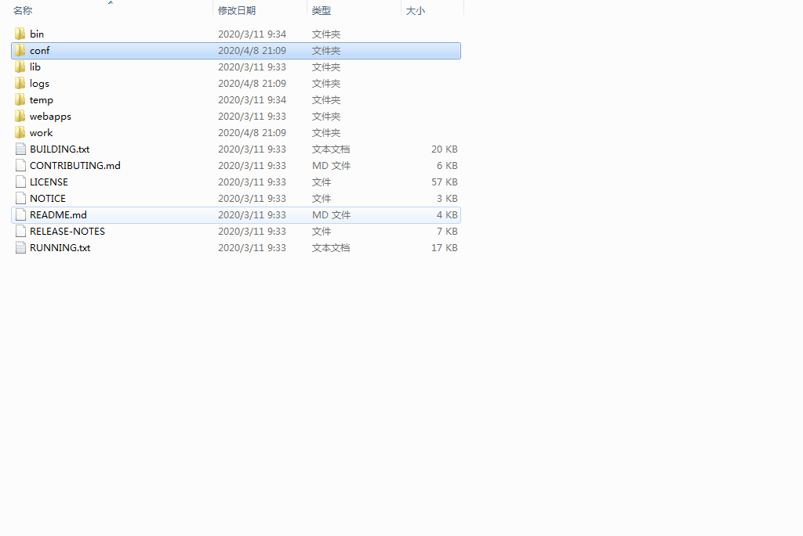

# Tomacat
### 1.Tomcat目录结构
    bin
    conf
    logs
    webapps
    ....


### 2.启动与关闭Tomcat
关闭  
1.bin/shutdown.sh  
2.control+C


### 3.更改配置端口

### 4.部署和配置项目
#### 4.1 方法一
webapps/virtual/项目目录or war包  
localhost:8080/virtual虚拟目录/virtual.html资源
#### 4.2 方法二  
conf/server.xml

```
<host>
  <Content docBase="项目路径" path="虚拟目录"/>
<host>
```
#### 4.3 方法三(热部署)
conf/Catalina/localhost 下创建文件 <虚拟目录Name>.xml  
内容:  
```
<Content docBase="项目路径" />
```
#### 4.4 动态项目目录结构
```
src  
/--java  
/--resource
WEB-INF
/--web.xml
/--lib目录
/--Classes
```
```
├── pom.xml
└── src
    ├── main
    │   ├── java
    │   │   └── group
    │   │       ├── controller
    │   │       │   ├── HomeController.java
    │   │       │   └── PersonController.java
    │   │       ├── dao
    │   │       │   └── PersonDao.java
    │   │       └── model
    │   │           └── Person.java
    │   ├── resources
    │   │   ├── db.properties
    │   │   ├── log4j.xml
    │   │   └── META-INF
    │   │       └── persistence.xml
    │   └── webapp
    │       ├── index.html
    │       ├── META-INF
    │       │   ├── context.xml
    │       │   └── MANIFEST.MF
    │       ├── resources
    │       │   └── css
    │       │       └── screen.css
    │       └── WEB-INF
    │           ├── spring
    │           │   ├── app
    │           │   │   ├── controllers.xml
    │           │   │   └── servlet-context.xml
    │           │   ├── db.xml
    │           │   └── root-context.xml
    │           ├── views
    │           │   ├── edit.jsp
    │           │   ├── home.jsp
    │           │   └── list.jsp
    │           └── web.xml
    └── test
        ├── java
        │   └── group
        │       ├── controller
        │       │   ├── DataInitializer.java
        │       │   ├── HomeControllerTest.java
        │       │   └── PersonControllerTest.java
        │       └── dao
        │           └── PersonDaoTest.java
        └── resources
            ├── db.properties
            ├── log4j.xml
            ├── test-context.xml
            └── test-db.xml

```


### N.SomeQuestion
3.1 出现乱码


原因：  编码格式不一致  
解决方案：  conf/logging.properties  
All UTF-8 替换为GBK  
java.util.logging.ConsoleHandler.encoding = UTF-8


MAC下
server.xml 中
```
<Connector port="8080" protocol="HTTP/1.1"
               connectionTimeout="20000"
               redirectPort="8443" URIEncoding="UTF-8"/>
```

成功


3.2 出现一闪而过的黑屏