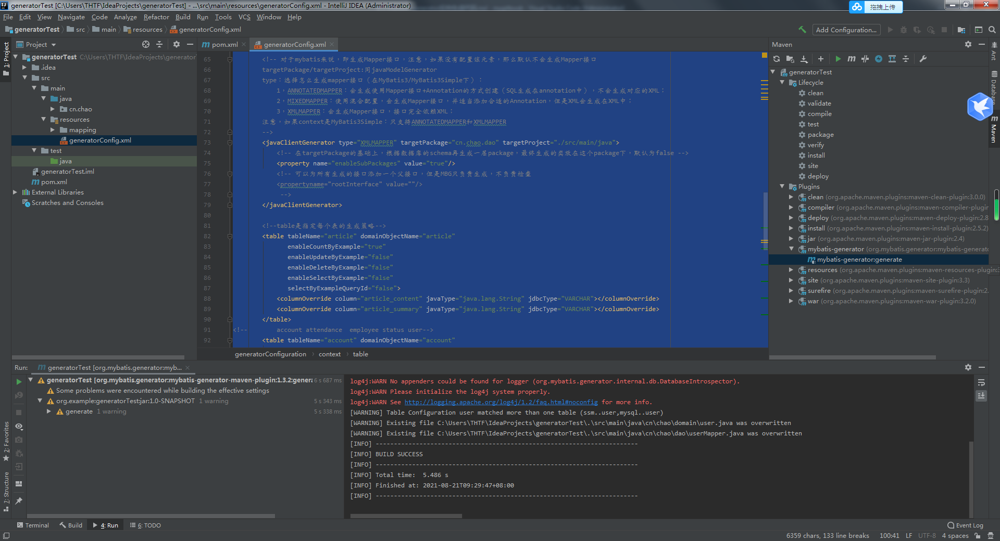
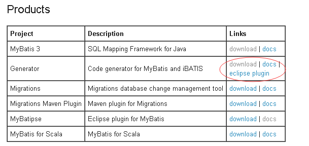
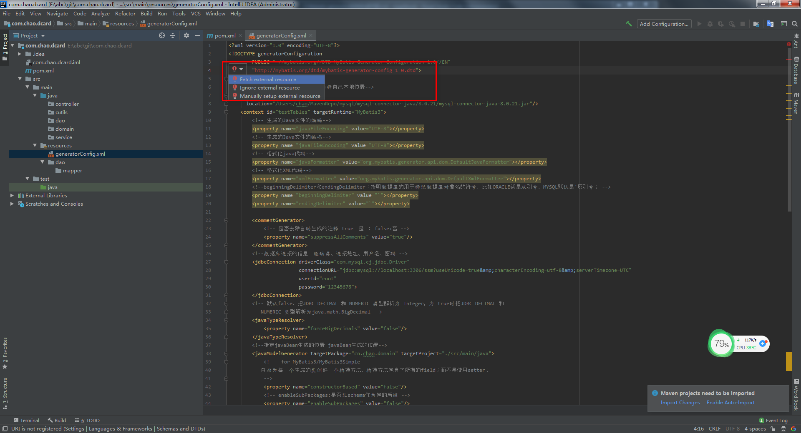

# 一般方式
主要有三种方法
+ 插件 
+ Maven包 （个人喜欢使用的）
+ 手写Java代码

# 基本流程
1.准备好数据库的库表
2.配置pom.xml中的插件
```
<plugin>
  <groupId>org.mybatis.generator</groupId>
  <artifactId>mybatis-generator-maven-plugin</artifactId>
  <version>1.3.2</version>
  <dependencies>
  <!--使用Mybatis-generator插件不能使用太高版本的mysql驱动 -->
    <dependency>
      <groupId>mysql</groupId>
        <artifactId>mysql-connector-java</artifactId>
          <version>8.0.21</version>
    </dependency>
  </dependencies>
  <configuration>
    <overwrite>true</overwrite>
  </configuration>
</plugin>
``` 
```
 <build>
        <plugins>
            <plugin>
                <artifactId>maven-clean-plugin</artifactId>
                <version>3.0.0</version>
            </plugin>
            <!-- see http://maven.apache.org/ref/current/maven-core/default-bindings.html#Plugin_bindings_for_war_packaging -->
            <plugin>
                <artifactId>maven-resources-plugin</artifactId>
                <version>3.0.2</version>
            </plugin>
            <plugin>
                <artifactId>maven-compiler-plugin</artifactId>
                <version>3.7.0</version>
            </plugin>
            <plugin>
                <artifactId>maven-surefire-plugin</artifactId>
                <version>2.20.1</version>
            </plugin>
            <plugin>
                <artifactId>maven-war-plugin</artifactId>
                <version>3.2.0</version>
            </plugin>
            <plugin>
                <artifactId>maven-install-plugin</artifactId>
                <version>2.5.2</version>
            </plugin>
            <plugin>
                <artifactId>maven-deploy-plugin</artifactId>
                <version>2.8.2</version>
            </plugin>
            <plugin>
                <groupId>org.mybatis.generator</groupId>
                <artifactId>mybatis-generator-maven-plugin</artifactId>
                <version>1.3.2</version>
                <dependencies>
                    <!--使用Mybatis-generator插件不能使用太高版本的mysql驱动 -->
                    <dependency>
                        <groupId>mysql</groupId>
                        <artifactId>mysql-connector-java</artifactId>
                        <version>8.0.21</version>
                    </dependency>
                </dependencies>
                <configuration>
                    <overwrite>true</overwrite>
                </configuration>
            </plugin>
        </plugins>
    </build>
```
3.编写generatorConfig.xml配置文件
```
<?xml version="1.0" encoding="UTF-8"?>
<!DOCTYPE generatorConfiguration
        PUBLIC "-//mybatis.org//DTD MyBatis Generator Configuration 1.0//EN"
        "http://mybatis.org/dtd/mybatis-generator-config_1_0.dtd">
<generatorConfiguration>
    <!--mysql 连接数据库jar 这里选择自己本地位置-->
    <classPathEntry
      location="E:\abc\repository\mysql\mysql-connector-java\8.0.21\mysql-connector-java-8.0.21.jar"/>
    <context id="testTables" targetRuntime="MyBatis3">
        <!-- 生成的Java文件的编码-->
        <property name="javaFileEncoding" value="UTF-8"></property>
        <!-- 生成的Java文件的编码-->
        <property name="javaFileEncoding" value="UTF-8"></property>
        <!-- 格式化java代码-->
        <property name="javaFormatter" value="org.mybatis.generator.api.dom.DefaultJavaFormatter"></property>
        <!-- 格式化XML代码-->
        <property name="xmlFormatter" value="org.mybatis.generator.api.dom.DefaultXmlFormatter"></property>
        <!--beginningDelimiter和endingDelimiter：指明数据库的用于标记数据库对象名的符号，比如ORACLE就是双引号，MYSQL默认是`反引号； -->
        <property name="beginningDelimiter" value="`"></property>
        <property name="endingDelimiter" value="`"></property>

        <commentGenerator>
            <!-- 是否去除自动生成的注释 true：是 ： false:否 -->
            <property name="suppressAllComments" value="true"/>
        </commentGenerator>
        <!--数据库连接的信息：驱动类、连接地址、用户名、密码 -->
        <jdbcConnection driverClass="com.mysql.cj.jdbc.Driver"
                        connectionURL="jdbc:mysql://39.101.162.217:3306/ssm?useUnicode=true&amp;characterEncoding=utf-8&amp;serverTimezone=UTC"
                        userId="chao"
                        password="chao">
        </jdbcConnection>
        <!-- 默认false，把JDBC DECIMAL 和 NUMERIC 类型解析为 Integer，为 true时把JDBC DECIMAL 和
           NUMERIC 类型解析为java.math.BigDecimal -->
        <javaTypeResolver>
            <property name="forceBigDecimals" value="false"/>
        </javaTypeResolver>
        <!--指定javaBean生成的位置 javaBean生成的位置-->
        <javaModelGenerator targetPackage="cn.chao.domain" targetProject="./src/main/java">
            <!--  for MyBatis3/MyBatis3Simple
           自动为每一个生成的类创建一个构造方法，构造方法包含了所有的field；而不是使用setter；
            -->
            <property name="constructorBased" value="false"/>
            <!-- enableSubPackages:是否让schema作为包的后缀 -->
            <property name="enableSubPackages" value="false"/>
            <!-- 是否清理从数据库中查询出的字符串左右两边的空白字符 -->
            <property name="trimStrings" value="true"/>
            <!-- for MyBatis3 / MyBatis3Simple
            是否创建一个不可变的类，如果为true，
            那么MBG会创建一个没有setter方法的类，取而代之的是类似constructorBased的类
            -->
            <property name="immutable" value="false"/>
            <!-- 设置一个根对象，
                如果设置了这个根对象，那么生成的keyClass或者recordClass会继承这个类；在Table的rootClass属性中可以覆盖该选项
                注意：如果在key class或者record class中有root class相同的属性，MBG就不会重新生成这些属性了，包括：
                   1，属性名相同，类型相同，有相同的getter/setter方法；
                -->
            <!--<property name="rootClass" value="com.trusause.app.domain.GenericEntity"/>-->
        </javaModelGenerator>

        <!--sql映射文件生成的位置-->
        <sqlMapGenerator targetPackage="mapping" targetProject="./src/main/resources">
            <property name="enableSubPackages" value="true"/>
        </sqlMapGenerator>

        <!-- 对于mybatis来说，即生成Mapper接口，注意，如果没有配置该元素，那么默认不会生成Mapper接口
        targetPackage/targetProject:同javaModelGenerator
        type：选择怎么生成mapper接口（在MyBatis3/MyBatis3Simple下）：
            1，ANNOTATEDMAPPER：会生成使用Mapper接口+Annotation的方式创建（SQL生成在annotation中），不会生成对应的XML；
            2，MIXEDMAPPER：使用混合配置，会生成Mapper接口，并适当添加合适的Annotation，但是XML会生成在XML中；
            3，XMLMAPPER：会生成Mapper接口，接口完全依赖XML；
        注意，如果context是MyBatis3Simple：只支持ANNOTATEDMAPPER和XMLMAPPER
        -->
        <javaClientGenerator type="XMLMAPPER" targetPackage="cn.chao.dao" targetProject="./src/main/java">
            <!-- 在targetPackage的基础上，根据数据库的schema再生成一层package，最终生成的类放在这个package下，默认为false -->
            <property name="enableSubPackages" value="true"/>
            <!-- 可以为所有生成的接口添加一个父接口，但是MBG只负责生成，不负责检查
            <propertyname="rootInterface" value=""/>
             -->
        </javaClientGenerator>

        <!--table是指定每个表的生成策略-->
        <table tableName="article" domainObjectName="article"
               enableCountByExample="true"
               enableUpdateByExample="false"
               enableDeleteByExample="false"
               enableSelectByExample="false"
               selectByExampleQueryId="false">
            <columnOverride column="article_content" javaType="java.lang.String" jdbcType="VARCHAR"></columnOverride>
            <columnOverride column="article_summary" javaType="java.lang.String" jdbcType="VARCHAR"></columnOverride>
        </table>
<!--        account attendance  employee status user-->
        <table tableName="account" domainObjectName="account"
               enableCountByExample="false"
               enableUpdateByExample="false"
               enableDeleteByExample="false"
               enableSelectByExample="false"
               selectByExampleQueryId="false">
        </table>

        <table tableName="attendance" domainObjectName="attendance"
               enableUpdateByExample="false"
               enableCountByExample="false"
               enableDeleteByExample="false"
               enableSelectByExample="false"
               selectByExampleQueryId="false">
        </table>

        <table tableName="employee" domainObjectName="employee"
               enableUpdateByExample="false"
               enableCountByExample="false"
               enableDeleteByExample="false"
               enableSelectByExample="false"
               selectByExampleQueryId="false">
        </table>

        <table tableName="status" domainObjectName="status"
               enableUpdateByExample="false"
               enableCountByExample="false"
               enableDeleteByExample="false"
               enableSelectByExample="false"
               selectByExampleQueryId="false">
        </table>

        <table tableName="user" domainObjectName="user"
               enableUpdateByExample="false"
               enableCountByExample="false"
               enableDeleteByExample="false"
               enableSelectByExample="false"
               selectByExampleQueryId="false">
        </table>


    </context>
</generatorConfiguration>
```
4.通过Maven的插件运行即可生成相应的代码


# 未完成
去官网查看各个参数的实际意义  
有时候生成奇怪的Blob格式的后缀

# 参考资料

MyBatis Generator 配置详解
https://blog.csdn.net/testcs_dn/article/details/79295065


https://www.cnblogs.com/yjmyzz/p/4210554.html  
https://blog.csdn.net/qi49125/article/details/52277686  

idea创建Maven项目时Maven插件内看不到mybatis-generator
https://blog.csdn.net/yytwiligt/article/details/81010360

MybatisGenerator生成WithBLOBS.java文件原因及解决方案
https://blog.csdn.net/qq_41969358/article/details/88056769  
MyBatis中的JdbcType映射介绍  
https://blog.csdn.net/bisal/article/details/82775403

MyBatis-Generato代码生成器取消生成xxxxKey实体类  
https://blog.csdn.net/u011781521/article/details/106264947

gradle使用mybatis-generator生成user表相关文件只生成mysql..user的原因说明
https://www.iteye.com/blog/357029540-2427342

MyBatis逆向工程生成xxxWithBLOBs、xxxKey  
http://events.jianshu.io/p/4e5a70c14b2d


# 其他


# 错误



# 快速记忆
```
<context id="testTables" targetRuntime="MyBatis3" defaultModelType="flat">

<jdbcConnection driverClass="com.mysql.cj.jdbc.Driver"
                        connectionURL="jdbc:mysql://39.101.162.217:3306/ssm?useUnicode=true&amp;characterEncoding=utf-8&amp;serverTimezone=UTC"
                        userId="chao"
                        password="chao">
   <property name = "nullCatalogMeansCurrent" value = "true"/>
</jdbcConnection>
```