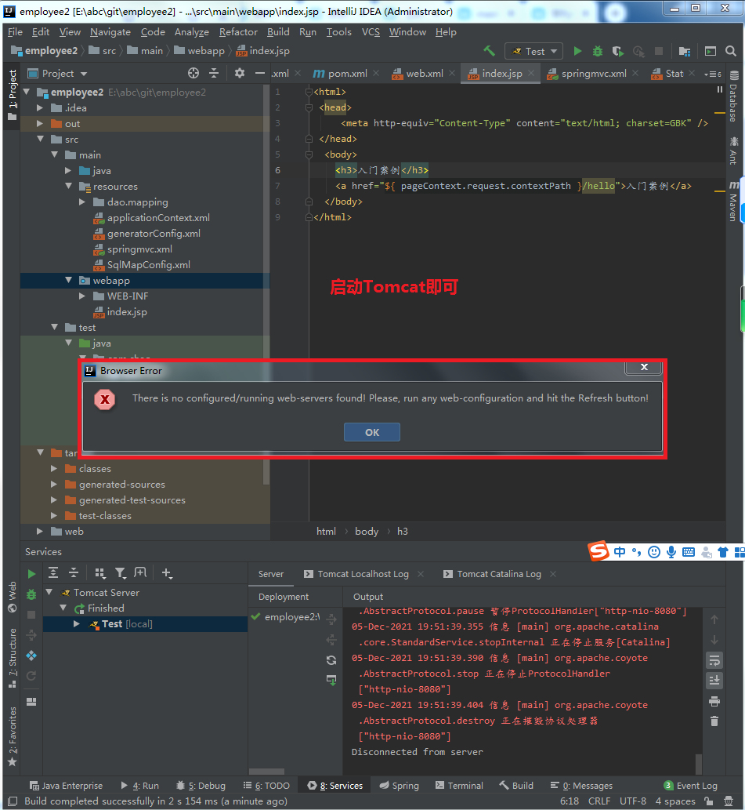

### Question 1
idea解决maven导入pageHelper插件，启动tomcat报ClassNotFoundException: com.github.pagehelper.PageInterceptor问题  

发现war_exploded并没有将pageHelper打包，
如下图所示，红框内表示未打包到项目中的jar包

发现问题那就简单了，把pagehelper放到lib就行，

https://blog.csdn.net/C_bianchengxiaobai/article/details/100574136

### Question2

