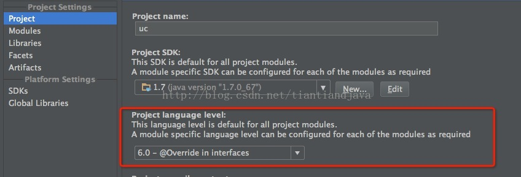
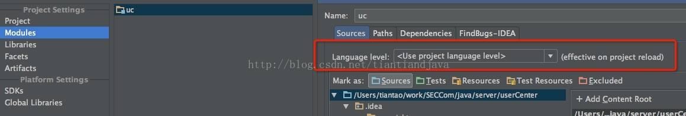

  
# IDEA 之 sdk和Language level  
在java项目中必不可少的是我们要指定一个jdk。

在指定jdk的同时，还可以指定jdk的Language level，这个有点像我们工程最低支持版本。比如Language level 设置了5.0 只是就不能出现使用6.0／7.0特性的代码。

因为这些特性在5.0的环境下是无法编译的。

或者可以理解ide会安装Language level指定的jdk版本来对我们的代码进行编译，以及错误检查。

在IntelliJ中有两个地方设置这个参数。

这个设置针对整个工程，或者说是工程默认的。

这里是针对模块的，这里才是正在生效的设置。

如果设置Use project language level 就是延用project的设置。

此处可以重新指定。project设置就失效。

这个设置需要重新载入项目  
————————————————
版权声明：本文为CSDN博主「我妻善逸丶honor」的原创文章，遵循CC 4.0 BY-SA版权协议，转载请附上原文出处链接及本声明。  
原文链接：https://blog.csdn.net/wei_gg/article/details/91445821