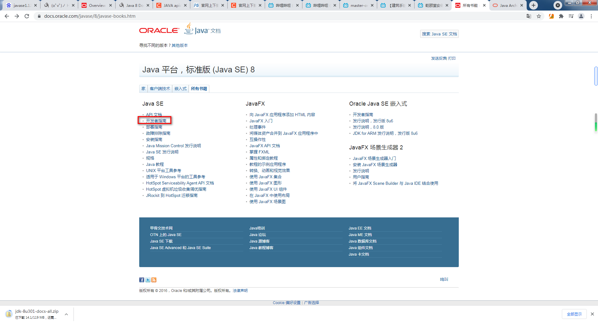
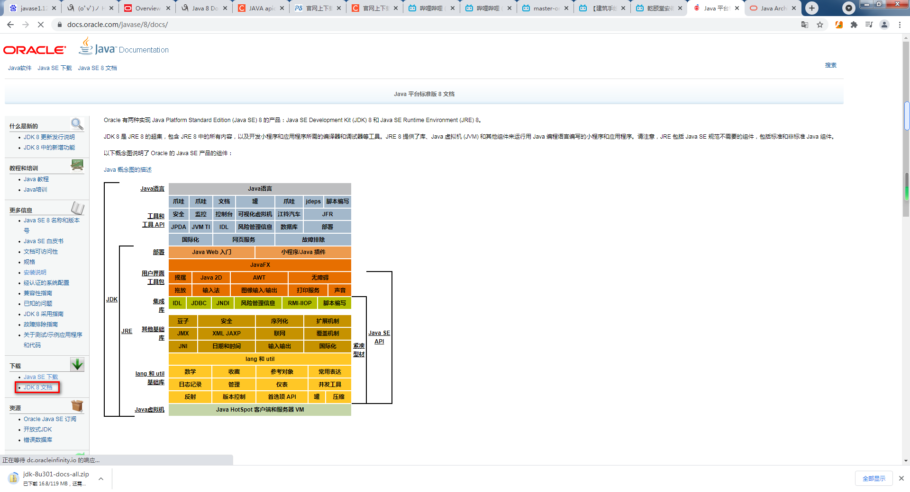
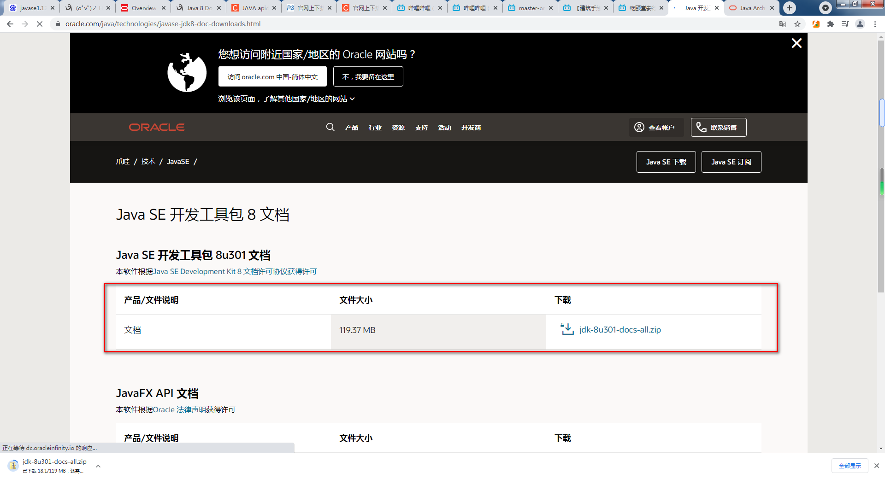

# JDK与JRE

### 安装JDK与配置路径
```
CLASSPATH
%JAVA_HOME%\lib;  
%JAVA_HOME%\lib\dt.jar;  
%JAVA_HOME%\lib\tools.jar

JAVA_HOME
C:\Program Files\Java\jdk1.8.0_181（!此处不应有分号）  
 
PATH
%JAVA_HOME%\bin;
```
配置环境出错：查看环境变量path;  
JAVA_HOME后加分号的结果  


# 下载JAVA API Document文档





原   因：   Java环境变量设置错误  
解决方案：  重新设置环境变量


# 类路径
1.一般项目  
- 1、类路径  
       就是项目的src下。  
- 2、获取类路径下的资源  
    使用类加载器：  
    Demo.class.getClassLoader() //获取一个类加载器  
    Demo.class.getClassLoader().getResourceAsStream("druid.properties"); //获取src下的资源  

2.SSM项目  


